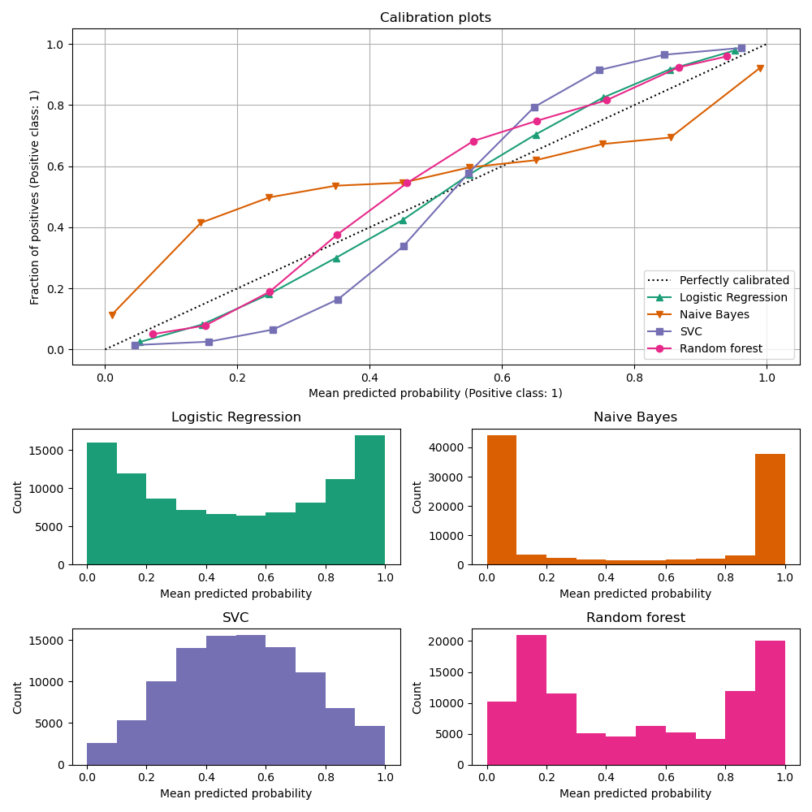
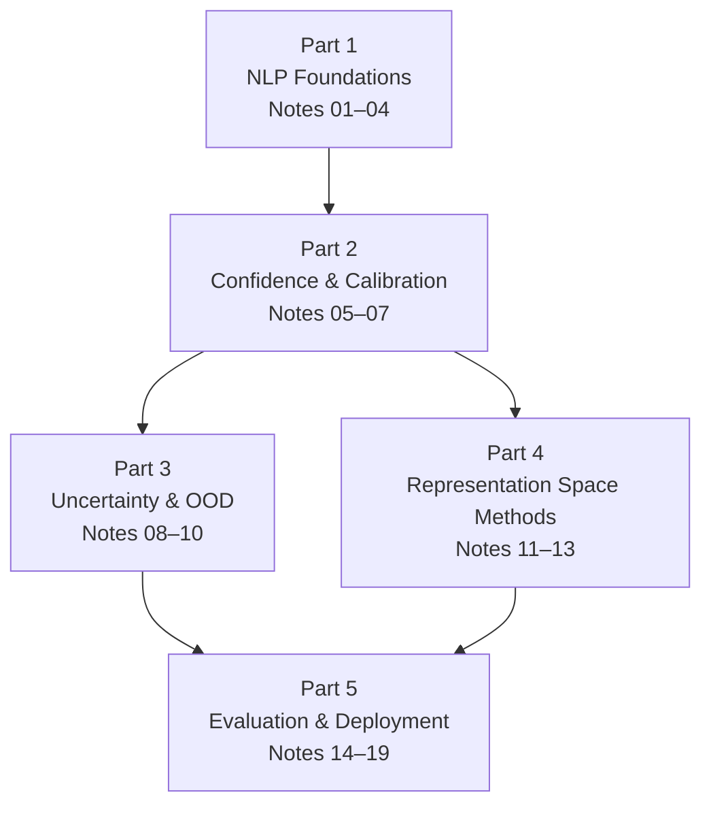

<div align="center">

# NLP Topics

### Study notes on NLP fundamentals and reliable machine learning for text classification

From tokenization to conformal prediction — measuring what a classifier actually knows, and when it is about to be wrong.



*The problem this collection circles around: a model can be 99% confident and still be wrong.*


[](LICENSE)

</div>

---

## About

This is a complete, self-contained curriculum in two movements:

1. **NLP foundations** (Notes 01–04) — the representation basics every later note assumes.
2. **Reliable ML for text** (Notes 05–19) — confidence, calibration, uncertainty quantification, out-of-distribution detection, neighborhood-based reliability signals, selective prediction, and conformal methods.

A clinical mental-health text classifier is the running example throughout, because high-stakes domains are where miscalibrated confidence stops being an academic annoyance and becomes a safety problem.

**What sets these notes apart:**

- **Every factual claim is cited** — inline `[n]` markers resolving to original papers, textbooks, and course materials
- **Full mathematical derivations** in LaTeX, not just intuition
- **Decision-oriented** — comparison tables for choosing between methods, failure-mode catalogs, production-deployment considerations

## Contents

- [The Curriculum](#the-curriculum)
- [Learning Path](#learning-path)
- [How to Use These Notes](#how-to-use-these-notes)
- [Repository Layout](#repository-layout)
- [Sources](#sources)

## The Curriculum

### Part 1 · NLP Foundations — *how text becomes vectors*

| # | Note | Covers |
| :- | :--- | :--- |
| 01 | [Tokenization](concepts/01.%20Tokenization.md) | BPE / WordPiece / SentencePiece, vocabulary trade-offs, tokenization pathologies as distribution-shift signals |
| 02 | [Embeddings](concepts/02.%20Embeddings.md) | Word2Vec → GloVe → ELMo → SBERT, InfoNCE, anisotropy in modern LLMs |
| 03 | [Attention](concepts/03.%20Attention.md) | Bahdanau/Luong attention, scaled dot-product attention, multi-head attention, FlashAttention, GQA |
| 04 | [Transformers and BERT](concepts/04.%20Transformers%20and%20BERT.md) | Architecture deep-dive, pre-training objectives, RoBERTa, LayerNorm stability |

### Part 2 · Confidence & Calibration — *why softmax confidence cannot be trusted*

| # | Note | Covers |
| :- | :--- | :--- |
| 05 | [Mental Health Classification](concepts/05.%20Mental%20Health%20Classification.md) | Datasets, models, label subjectivity, human-in-the-loop pipelines |
| 06 | [Confidence Scores & Softmax](concepts/06.%20Confidence%20and%20Softmax.md) | Softmax geometry and gradients, temperature, failure modes, alternatives |
| 07 | [Model Calibration & Temperature Scaling](concepts/07.%20Calibration%20and%20Scaling.md) | ECE / NLL / Brier, post-hoc calibration, calibration under domain shift |

### Part 3 · Uncertainty & OOD Detection — *independent evidence of impending failure*

| # | Note | Covers |
| :- | :--- | :--- |
| 08 | [Uncertainty Quantification](concepts/08.%20Uncertainty%20Quantification.md) | Aleatoric vs. epistemic uncertainty, Bayesian DL, MC Dropout, Deep Ensembles, evidential DL |
| 09 | [OOD Detection & Semantic Rarity](concepts/09.%20OOD%20and%20Semantic%20Rarity.md) | MSP baseline, ODIN, energy-based detection, Mahalanobis distance, ReAct/ASH, token-level rarity |
| 10 | [Information Theory & Distributional Disagreement](concepts/10.%20Information%20Theory%20and%20Distributional%20Disagreement.md) | Entropy, KL/JS divergence, mutual information, neighborhood distributions |

### Part 4 · Representation Space Methods — *what geometry knows that logits don't*

| # | Note | Covers |
| :- | :--- | :--- |
| 11 | [Representation Geometry](concepts/11.%20Representation%20Geometry.md) | Manifold hypothesis, local vs. global structure, hubness, anisotropy, neighborhood stability |
| 12 | [Trust Scores & Reliability Estimation](concepts/12.%20Trust%20Scores%20%26%20Reliability%20Estimation.md) | Accuracy vs. calibration vs. reliability, ConfidNet, Trust Scores |
| 13 | [Deep kNN and Neighborhood Methods](concepts/13.%20Deep%20kNN%20and%20Neighborhood%20Methods.md) | DkNN, LOF, kNN-LM, FAISS/HNSW, neighbor weighting schemes |

### Part 5 · Evaluation & Deployment — *proving it works and shipping it safely*

| # | Note | Covers |
| :- | :--- | :--- |
| 14 | [Statistical Inference for Reliability](concepts/14.%20Statistical%20Inference%20for%20Reliability.md) | Logistic regression, nested-model likelihood-ratio tests, pseudo-R², bootstrap CIs |
| 15 | [Selective Prediction & Abstention](concepts/15.%20Selective%20Prediction%20and%20Abstention.md) | Chow's rule, risk–coverage trade-offs, cost-sensitive abstention |
| 16 | [Conformal Prediction](concepts/16.%20Conformal%20Prediction.md) | Split CP, adaptive prediction sets, Mondrian CP, risk control, exchangeability limits |
| 17 | [Embedding Evaluation](concepts/17.%20Embedding%20Evaluation.md) | MTEB, BEIR, uniformity and drift checks before relying on an embedding space |
| 18 | [Explainable Reliability](concepts/18.%20Explainable%20Reliability.md) | Intrinsic vs. post-hoc XAI, example-based explanations, clinical trust |
| 19 | [Reliability Evaluation Metrics](concepts/19.%20Reliability%20Evaluation%20Metrics.md) | AUROC / AUPRC, AURC / E-AURC, FPR95, ablation design |

## Learning Path



Notes are numbered deliberately and cross-reference each other by number (`Note 15`, `Note 17`, …). Read sequentially for the full arc, or jump into any part — each note lists its own references.

## How to Use These Notes

- **Study:** Each note opens with a conceptual hierarchy diagram, builds formalism with derivations, and closes with full citations.
- **Reference:** Comparison tables let you pick a method without re-reading theory (e.g., calibration methods in Note 07, nonconformity scores in Note 16, evaluation metrics in Note 19).
- **Research:** Use `references.md` as a reading-list starting point; use `concepts.md` to find the best courses, books, and tools per topic.

## Repository Layout

```text
.
├── README.md            ← you are here
├── concepts.md          per-topic index of learning resources
├── references.md        full literature list (papers, books, courses, tools)
├── concepts/            the 19 study notes
└── images/              architecture and concept diagrams
```

## Sources

All claims are cited inline with numbered references pointing to primary sources:

- **Textbooks** — Jurafsky & Martin, Goodfellow et al., Cover & Thomas, Hastie et al., Murphy
- **Papers** — NeurIPS, ICML, ICLR, ACL, EMNLP and arXiv preprints
- **Courses** — Stanford CS224N / CS231n, Hugging Face NLP Course, MIT 6.S191
- **Tools** — PyTorch, scikit-learn, FAISS, statsmodels, MAPIE, Captum

Corrections and suggested additions are welcome via issues.

## License

Released under the [MIT License](LICENSE).
