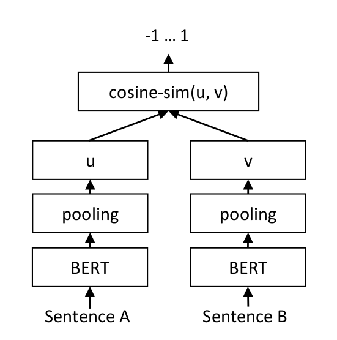

# Embeddings

Comprehensive study notes on static and contextualised word and sentence embeddings. All claims are cited. Sources are expanded beyond the original reference list to include GloVe, BERT sentence-level work, the DeepLearning.AI specialisation, contrastive learning math (InfoNCE), and geometric isotropy analysis in modern LLMs.

Embeddings are the fundamental mechanism by which NLP systems convert discrete symbolic tokens into points in a continuous vector space. Every downstream computation — attention, classification, generation — operates on these vectors. The quality of the embedding space determines how much semantic and syntactic information is accessible to the model *before* any task-specific learning [1][2].

---

## 1. The Representation Problem

A neural network cannot operate on strings. It requires real-valued vectors. The naive encoding of a vocabulary of size $`V`$ as one-hot vectors — vectors of dimension $`V`$ with a single 1 — has catastrophic properties [1]:

```
"king"  → [0, 0, 1, 0, 0, ..., 0]   (dimension = |V|)
"queen" → [0, 0, 0, 1, 0, ..., 0]
```

- **Dimensionality:** For a vocabulary of 50,000 words, every token is a 50,000-dimensional vector — mostly zeros
- **No similarity structure:** The cosine similarity between any two distinct one-hot vectors is exactly 0. `"dog"` and `"cat"` are as similar as `"dog"` and `"algorithm"`
- **No generalisation:** The model cannot infer anything about unseen words from seen ones

The solution: replace one-hot vectors with learned *dense* vectors of much lower dimension (50–3072 typically), where the positions in the vector space encode semantic and syntactic relationships [1][2].

### The Distributional Hypothesis

The theoretical foundation of all embedding methods:

> *"You shall know a word by the company it keeps."* — J.R. Firth, 1957

Words that appear in similar linguistic contexts tend to have similar meanings. This is empirically robust — `"bank"` appears near `"money"`, `"loan"`, `"river"`, `"account"`. The distributional profile of a word in a large corpus is a rich proxy for its meaning [1].

---

## 2. Static Embeddings: Word2Vec

### 2.1 The Core Insight

Word2Vec [2] (Mikolov et al., 2013) trains a shallow neural network with the **sole objective of predicting words from their context** — or context from a target word. The network weights learned during this task become the embeddings. Crucially, the task itself is discarded; only the weights matter.

The key contribution: Mikolov et al. showed that high-quality embeddings of dimension 300 could be learned from 1.6 billion words **in less than one day** on a single CPU — orders of magnitude faster than prior neural language model approaches. This efficiency came from two novel architectures.

### 2.2 Continuous Bag-of-Words (CBOW)

Given a context window of words surrounding a target position, predict the target word:

```
Context:  ["The", "cat", ___, "on", "the"]
Target:   "sat"

Input:  Average of embeddings of ["The", "cat", "on", "the"]
Output: Softmax over full vocabulary → predict "sat"
```

**Architecture:**
- Input layer: sum/average of one-hot context vectors
- Hidden layer: $`V \times D`$ weight matrix (this becomes the embedding matrix)
- Output layer: $`D \times V`$ weight matrix + softmax

For vocabulary $`V = 10{,}000`$ and embedding dimension $`D = 300`$: the hidden layer is a $`10{,}000 \times 300`$ weight matrix. The weight vector for position $`i`$ in this matrix is the embedding for word $`i`$.

**Training:** Backpropagation of cross-entropy loss. The model learns to position words so that context-sharing words end up near each other in embedding space.

### 2.3 Skip-Gram with Negative Sampling (SGNS)

Skip-gram reverses the prediction: given a target word, predict each context word.

**Binary formulation with Negative Sampling [2]:**

Instead of computing a softmax over the full vocabulary (expensive: $`O(V)`$ per update), SGNS reformulates the task as binary classification: *"Is this (word, context) pair a real pair or a random noise pair?"*

For each real (target $`w`$, context $`c`$) pair sampled from the corpus, sample $`k`$ "noise" context words $`c_1, \ldots, c_k`$ from a unigram distribution $`P_n(w) \propto f(w)^{3/4}`$ (the 3/4 power smooths out the frequency distribution):

```math
\mathcal{L} = \log \sigma(\mathbf{w} \cdot \mathbf{c}) + \sum_{i=1}^{k} \mathbb{E}_{c_i \sim P_n} \left[ \log \sigma(-\mathbf{w} \cdot \mathbf{c}_i) \right]
```

Each update only requires computing inner products with $`k+1`$ vectors (typically $`k = 5`$–$`20`$), not all $`V`$ words. This reduces per-step cost from $`O(V)`$ to $`O(k)`$ — a 1000× speedup for large vocabularies [2].

**Why 3/4 power?** Empirically reduces the model's tendency to over-represent very frequent words (stop words) as context and ensures that rarer but meaningful words appear as negative samples with non-negligible probability.

### 2.4 Word2Vec Geometric Properties

The learned embedding space has remarkable structural properties [2]:

**Linear analogies:**
```math
\text{vec}(\text{"king"}) - \text{vec}(\text{"man"}) + \text{vec}(\text{"woman"}) \approx \text{vec}(\text{"queen"})
```
```math
\text{vec}(\text{"Paris"}) - \text{vec}(\text{"France"}) + \text{vec}(\text{"Germany"}) \approx \text{vec}(\text{"Berlin"})
```

These analogies work because relational structure is encoded as **consistent vector offsets**. The "royal" relationship is a near-constant vector in the space.

**Syntactic structure:** Word2Vec also encodes syntactic relationships:
```math
\text{vec}(\text{"running"}) - \text{vec}(\text{"run"}) \approx \text{vec}(\text{"swimming"}) - \text{vec}(\text{"swim"})
```

The -ing morpheme corresponds to a consistent offset direction.

**Measured benchmarks [2]:**
- Word similarity (WordSim-353): SGNS achieves 0.74 Spearman correlation
- Analogy task accuracy: 65% on semantic, 56% on syntactic subtasks
- Key factors: embedding dimension 300, context window 5–10, negative samples 5–20

### 2.5 Trade-offs of Word2Vec

| Dimension | Advantage | Limitation |
| :--- | :--- | :--- |
| Speed | Very fast training (hours on billions of words) | Requires large corpus to learn quality embeddings |
| Compositionality | Linear structure for many relations | Additive composition only; no syntax-aware structure |
| Context | Efficient via SGNS | **Fixed context window** — no sentence-level context |
| Polysemy | N/A | Single vector per word regardless of meaning: `"bank"` (financial) = `"bank"` (river) |
| OOV | N/A | Unknown words have no embedding — requires fallback |

The polysemy failure is the fundamental limitation. The word `"depression"` in `"economic depression"` and `"clinical depression"` receives the same vector — mixing financial and psychiatric contexts in exactly the wrong way for a mental health classifier.

---

## 3. GloVe: Global Vectors for Word Representation

### 3.1 The Core Idea

GloVe [3] (Pennington et al., 2014) decomposes the **global word co-occurrence matrix** rather than training on sliding windows. The key insight: the ratio of co-occurrence probabilities encodes meaning more reliably than individual probabilities.

For words $`i`$, $`j`$, and a probe word $`k`$, the ratio $`P(k|i) / P(k|j)`$ indicates whether $`k`$ is more associated with $`i`$ or $`j`$:

| Probe word $`k`$ | $`P(k \| \text{"ice"})`$ | $`P(k \| \text{"steam"})`$ | Ratio |
| :--- | :--- | :--- | :--- |
| "solid" | $`1.9 \times 10^{-4}`$ | $`2.2 \times 10^{-5}`$ | **8.9** (high → solid relates to ice) |
| "gas" | $`6.6 \times 10^{-5}`$ | $`7.8 \times 10^{-4}`$ | **0.085** (low → gas relates to steam) |
| "water" | $`3.0 \times 10^{-3}`$ | $`2.2 \times 10^{-3}`$ | 1.36 (neutral) |
| "fashion" | $`1.7 \times 10^{-5}`$ | $`1.8 \times 10^{-5}`$ | 0.96 (neutral) |

GloVe trains embeddings so that the **dot product of two word vectors equals the log of their co-occurrence probability**:

```math
\mathbf{w}_i \cdot \tilde{\mathbf{w}}_j + b_i + \tilde{b}_j = \log(X_{ij})
```

Objective (weighted least squares over all co-occurring pairs):

```math
J = \sum_{i,j=1}^{V} f(X_{ij})\left(\mathbf{w}_i \cdot \tilde{\mathbf{w}}_j + b_i + \tilde{b}_j - \log X_{ij}\right)^2
```

where $`f(X_{ij})`$ is a weighting function that down-weights very frequent pairs:
```math
f(x) = \begin{cases} (x/x_{\max})^\alpha & \text{if } x < x_{\max} \\ 1 & \text{otherwise} \end{cases}
```
with $`\alpha = 0.75`$ and $`x_{\max} = 100`$ in the original paper [3].

### 3.2 GloVe vs. Word2Vec

- **GloVe** sees each co-occurrence count once (or a few times for training passes on the co-occurrence matrix) — efficient for memory, leverages global statistics
- **Word2Vec** sees each word-context pair in the order it appears in the corpus — naturally handles corpus streaming but ignores global co-occurrence structure
- In practice: GloVe performs slightly better on analogy and similarity benchmarks; Word2Vec is easier to implement and update incrementally [3]

---

## 4. FastText: Subword-Aware Embeddings

### 4.1 Motivation

Both Word2Vec and GloVe assign a single embedding to each **word type**. This fails for:
- Morphologically rich languages: Finnish, Turkish, Hungarian
- Languages with many compounds: German (`Donaudampfschifffahrtsgesellschaft`)
- Rare words and proper nouns
- Words unseen during training (OOV)

### 4.2 Character n-gram Embeddings

FastText [4] (Bojanowski et al., 2017) decomposes each word into a **bag of character n-grams** plus the word itself. For the word `"where"` with $`n=3`$:

```
Subwords: <wh, whe, her, ere, re>, <where>
(< and > mark word boundaries)
```

The word's embedding is the **sum** of all its subword embeddings:
```math
\mathbf{v}(\text{"where"}) = \sum_{g \in \mathcal{G}(\text{"where"})} \mathbf{z}_g
```

where $`\mathcal{G}(w)`$ is the set of character n-grams of word $`w`$ (with $`n \in [3, 6]`$ typically).

**OOV handling:** For an unknown word `"preprocessing"`, FastText computes its embedding as the sum of its n-gram embeddings, even if the full word never appeared in training. This is a key advantage over Word2Vec and GloVe [4].

**Evaluation [4]:**
- Tested on 9 languages, outperforming Word2Vec on morphological similarity tasks
- Especially strong on Czech, German, Arabic — languages with rich morphology
- Competitive with Word2Vec on English (where morphology is simpler)

### 4.3 Trade-offs

| Advantage | Limitation |
| :--- | :--- |
| Handles OOV via n-gram composition | More parameters (n-gram embedding table) |
| Better for morphologically rich languages | Slower inference (sum over n-grams) |
| Can represent rare words | n-gram table can be memory-intensive for large $`n`$ |
| Subword structure aligns with tokenization | May conflate morphologically similar but semantically different words |

---

## 5. ELMo: The Contextualisation Breakthrough

### 5.1 The Polysemy Problem, Revisited

Static embeddings (Word2Vec, GloVe, FastText) assign **one fixed vector per word type**. The word `"play"` gets a single vector averaged over all its uses:
- "Let's **play** a game" (recreational)
- "I saw the **play**" (theatrical performance)
- "the stock market **play**" (financial strategy)

These senses are conflated into a centroid that may not represent any individual sense accurately. This directly degrades performance on word sense disambiguation, coreference, NER in ambiguous contexts, and mental health text classification, where clinical uses of words ("depressed", "suicidal") must be distinguished from casual uses.

### 5.2 ELMo Architecture

ELMo [5] (Peters et al., 2018) — Embeddings from Language Models — produces **context-dependent** embeddings. The same word gets a different embedding depending on the sentence it appears in.

**Architecture:**
1. **Character CNN input layer:** A 1D CNN over character embeddings, producing a fixed-length vector for each word type. This handles OOV — any word can be encoded regardless of its frequency.

2. **Two-layer biLSTM:** Two bidirectional LSTM layers, each processing the sequence in both directions:
   - Forward LSTM: reads left-to-right, capturing `"left context of the word"`
   - Backward LSTM: reads right-to-left, capturing `"right context of the word"`
   - At each layer $`l`$ and position $`k`$: forward hidden state $`\overrightarrow{h}_{k,l}`$ and backward hidden state $`\overleftarrow{h}_{k,l}`$

3. **Concatenation:** At each layer, concatenate the two directions: $`h_{k,l} = [\overrightarrow{h}_{k,l}; \overleftarrow{h}_{k,l}]`$

4. **Task-specific combination:** For a downstream task, ELMo computes a **learned weighted sum** of all LSTM layer representations:
```math
\text{ELMo}_k^{task} = E(R_k; \Theta^{task}) = \gamma^{task} \sum_{j=0}^{L} s_j^{task} h_{k,j}
```

where $`s_j^{task}`$ are softmax-normalised scalar weights and $`\gamma^{task}`$ is a scalar that scales the entire ELMo vector. Both $`s_j^{task}`$ and $`\gamma^{task}`$ are learned during fine-tuning.

**The key finding [5]:** Different layers encode different linguistic properties:
- **Lower layers** (layer 1): Part-of-speech, morphological information, syntax
- **Higher layers** (layer 2): Word sense, semantic information, coreference

Different tasks benefit from different layer combinations — the learned mixture automatically selects the right balance. For tasks requiring semantic disambiguation (e.g., mental health classification), higher layers dominate. For tasks requiring syntactic structure (e.g., dependency parsing), lower layers dominate.

### 5.3 ELMo Results [5]

ELMo was fine-tuned and evaluated on six diverse NLP benchmarks:

| Task | Baseline | +ELMo | Improvement |
| :--- | :--- | :--- | :--- |
| SQuAD (QA) | 81.1 F1 | 85.8 F1 | +4.7 |
| SNLI (entailment) | 88.6% | 91.6% | +3.0 |
| Sentiment (SST-5) | 53.7% | 54.7% | +1.0 |
| NER (CoNLL 2003) | 90.15 F1 | 92.22 F1 | +2.06 |
| Coreference | 67.2 F1 | 70.4 F1 | +3.2 |
| SRL | 81.4 F1 | 84.6 F1 | +3.2 |

These were near-universal improvements across task types — evidence that richer contextual representations provide genuine and transferable benefits [5].

### 5.4 Limitations of ELMo

- **LSTM sequential bottleneck:** Each position must wait for the previous position to be processed. Cannot parallelise across sequence positions — slow to train on large corpora.
- **Shallow interaction:** The forward and backward LSTMs only interact through concatenation at the output. Each direction is independently computed — no cross-direction attention within layers.
- **Two-directional but not truly bidirectional:** The forward pass at position $`k`$ sees only positions $`1, \ldots, k-1`$. The backward pass sees only $`k+1, \ldots, n`$. Position $`k`$ itself never simultaneously conditions on full context — this is the problem BERT was designed to fix.

---

## 6. Sentence Embeddings and SBERT

### 6.1 The Semantic Similarity Problem

Many tasks require comparing entire sentences rather than individual words:
- Semantic textual similarity (STS)
- Question-answer retrieval
- Document clustering and deduplication
- Semantic search in mental health triage systems

Raw BERT requires **both sentences simultaneously** as input to produce a similarity score. Finding the most similar sentence in a collection of 10,000 requires $`\binom{10{,}000}{2} = 49{,}995{,}000`$ forward passes — approximately **65 hours** on a modern GPU [6].

### 6.2 SBERT Architecture

Sentence-BERT [6] (Reimers & Gurevych, 2019) uses a **Siamese network** structure to train BERT to produce fixed-length sentence embeddings that can be compared with cosine similarity in $`O(1)`$ per pair:

```
Sentence A ──► BERT ──► Mean Pool ──► u  ─┐
                                            ├──► |u - v|, u⊙v → Classifier
Sentence B ──► BERT ──► Mean Pool ──► v  ─┘
(weights shared)
```

**Pooling:** The `[CLS]` token embedding was found inferior to **mean pooling** across all token positions — averaging the hidden states of all tokens. This produces an embedding that integrates information across the full sequence rather than relying on a single designated position [6].


*Figure 1: SBERT Siamese Network Architecture for sentence embeddings. Source: Sentence-BERT Official Documentation [6].*

Raw BERT requires both sentences simultaneously as input to produce a similarity score. Finding the most similar sentence in a collection of 10,000 requires ~50M forward passes (65 hours). SBERT enables this in milliseconds by pre-computing fixed embeddings.

### 6.3 Contrastive Learning and InfoNCE

Modern sentence embeddings (like OpenAI's `text-embedding-3`, BGE, and modern SBERT variants) rely on the **InfoNCE** (Information Noise-Contrastive Estimation) loss.

Given a batch of $`N`$ pairs of anchor and positive sentences $`(x_i, x_i^+)`$, InfoNCE treats all other $`N-1`$ positives in the batch as "in-batch negatives" for $`x_i`$:

```math
\mathcal{L}_{InfoNCE} = -\frac{1}{N} \sum_{i=1}^{N} \log \frac{\exp(\text{sim}(h_i, h_i^+) / \tau)}{\sum_{j=1}^{N} \exp(\text{sim}(h_i, h_j^+) / \tau)}
```

where $`\tau`$ is a temperature hyperparameter controlling the sharpness of the softmax, and $`\text{sim}`$ is cosine similarity. This objective forces the model to pull semantically similar sentences together while pushing all other sentences in the batch apart, leading to highly structured and uniformly distributed embedding spaces.

### 6.4 The Anisotropy Problem in BERT

A well-known flaw of off-the-shelf BERT models is **anisotropy** — the learned representations occupy a narrow cone in the embedding space rather than being uniformly distributed.

Because of anisotropy, any two random sentences embedded by raw BERT will have a very high cosine similarity (often $`> 0.95`$). This makes differentiation difficult. Mean pooling combined with contrastive learning "unfolds" this cone, enforcing isotropy so the full vector space is utilized.

### 6.5 Performance and Efficiency

| System | STS-b Spearman | SentEval avg | Inference time (10k pairs) |
| :--- | :--- | :--- | :--- |
| Raw BERT (`[CLS]`) | 20.29 | 74.89 | 65 hours |
| BERT mean pooling | 54.81 | 74.31 | 65 hours |
| **SBERT** | **84.67** | **80.78** | **~5 seconds** |
| InferSent | 75.77 | 74.24 | ~1 second |
| Universal Sentence Encoder | 74.92 | 74.92 | ~1 second |

SBERT achieves a **4× improvement** on STS-b over raw BERT pooling while reducing pairwise comparison time from 65 hours to 5 seconds [6].

### 6.6 SBERT Applications in Mental Health NLP

In mental health text classification contexts, SBERT embeddings enable:
- **Semantic search:** Given a new post `"I can't get out of bed, everything feels pointless"`, retrieve the 5 most semantically similar labelled examples for few-shot classification
- **Clustering:** Discover thematic groupings in unlabelled mental health data (e.g., separating anxiety-related from depression-related posts)
- **OOD detection:** Measure the cosine distance from a new input to the centroid of training examples — a proxy for semantic out-of-distribution-ness

**Why SBERT?** If an application requires computing sentence similarities at scale, SBERT is what makes estimating this distance computationally feasible at runtime.

---

## 7. The Embedding Evolution Timeline

```
┌─────────────────────────────────────────────────────────────────────────┐
│                    EMBEDDING EVOLUTION                                   │
│                                                                          │
│  2013  Word2Vec ──── One embedding per word type (static)               │
│         └── Skipgram with negative sampling, analogy benchmarks         │
│                                                                          │
│  2014  GloVe ─────── Global co-occurrence matrix factorisation         │
│         └── Count-based alternative to prediction-based                │
│                                                                          │
│  2017  FastText ──── Subword character n-gram composition               │
│         └── OOV handling, morphologically rich languages               │
│                                                                          │
│  2018  ELMo ─────── Contextualised: same word, different vectors        │
│         └── Bidirectional LSTM, layer-weighted combination             │
│                                                                          │
│  2018  BERT ─────── Transformer contextualisation (Chapter: BERT)       │
│         └── Truly bidirectional via masked attention                   │
│                                                                          │
│  2019  SBERT ─────── Fixed-length sentence embeddings via Siamese BERT  │
│         └── Enables semantic search, clustering at scale               │
│                                                                          │
│  2022+ MTEB era ─── Multi-task embedding benchmarks                     │
│         └── E5, BGE, GTE — unified text embedding models               │
└─────────────────────────────────────────────────────────────────────────┘
```

---

## 8. Embedding Properties and Evaluation

### 8.1 Intrinsic Evaluation

**Word similarity:** Given pairs like (`"car"`, `"automobile"`), measure correlation between cosine similarity and human judgements (WordSim-353, SimLex-999).

**Analogy completion:** Given (`"man"`, `"king"`, `"woman"`), retrieve the word closest to $`v(\text{"king"}) - v(\text{"man"}) + v(\text{"woman"})`$. Success = `"queen"`. Benchmark: Google Analogy Dataset (19,544 analogies).

**Limitations of intrinsic evaluation:** High performance on analogy benchmarks does not guarantee better downstream task performance — a well-documented disconnect [7].

### 8.2 Extrinsic Evaluation

Plug embeddings into a downstream model and measure task performance. More reliable indicator of utility, but task-specific [7].

### 8.3 MTEB: Massively Multitask Text Embedding Benchmark

The modern standard [9] evaluates sentence embedding models across 56 tasks in 7 categories:
- Retrieval, Classification, Clustering, Pair Classification, Reranking, STS, Summarisation

Top models (2024): `text-embedding-3-large` (OpenAI), `e5-mistral-7b-instruct` (Microsoft), `bge-large-en-v1.5` (BAAI).

---

## References

* **[1]** D. Jurafsky and J. H. Martin, *Speech and Language Processing*, 3rd ed., Chapter 6: Vector Semantics and Embeddings. Available: [https://web.stanford.edu/~jurafsky/slp3/](https://web.stanford.edu/~jurafsky/slp3/)
* **[2]** T. Mikolov, K. Chen, G. Corrado, and J. Dean, "Efficient Estimation of Word Representations in Vector Space," *ICLR 2013*, arXiv:1301.3781. Available: [https://arxiv.org/abs/1301.3781](https://arxiv.org/abs/1301.3781)
* **[3]** J. Pennington, R. Socher, and C. Manning, "GloVe: Global Vectors for Word Representation," *EMNLP 2014*. Available: [https://aclanthology.org/D14-1162/](https://aclanthology.org/D14-1162/)
* **[4]** P. Bojanowski, E. Grave, A. Joulin, and T. Mikolov, "Enriching Word Vectors with Subword Information," *TACL 2017*, arXiv:1607.04606. Available: [https://arxiv.org/abs/1607.04606](https://arxiv.org/abs/1607.04606)
* **[5]** M. Peters et al., "Deep Contextualized Word Representations (ELMo)," *NAACL 2018*, arXiv:1802.05365. Available: [https://arxiv.org/abs/1802.05365](https://arxiv.org/abs/1802.05365)
* **[6]** N. Reimers and I. Gurevych, "Sentence-BERT: Sentence Embeddings using Siamese BERT-Networks," *EMNLP 2019*, arXiv:1908.10084. Available: [https://arxiv.org/abs/1908.10084](https://arxiv.org/abs/1908.10084)
* **[7]** DeepLearning.AI, *Natural Language Processing Specialization*. Available: [https://www.deeplearning.ai/specializations/natural-language-processing](https://www.deeplearning.ai/specializations/natural-language-processing)
* **[8]** J. Ji et al., "MentalBERT: Publicly Available Pretrained Language Models for Mental Healthcare," *IJCAI 2022*, arXiv:2110.15621. Available: [https://arxiv.org/abs/2110.15621](https://arxiv.org/abs/2110.15621)
* **[9]** N. Muennighoff et al., "MTEB: Massive Text Embedding Benchmark," *EACL 2023*, arXiv:2210.07316. Available: [https://arxiv.org/abs/2210.07316](https://arxiv.org/abs/2210.07316)
* **[10]** T. Gao et al., "SimCSE: Simple Contrastive Learning of Sentence Embeddings," *EMNLP 2021*, arXiv:2104.08821. Available: [https://arxiv.org/abs/2104.08821](https://arxiv.org/abs/2104.08821)
