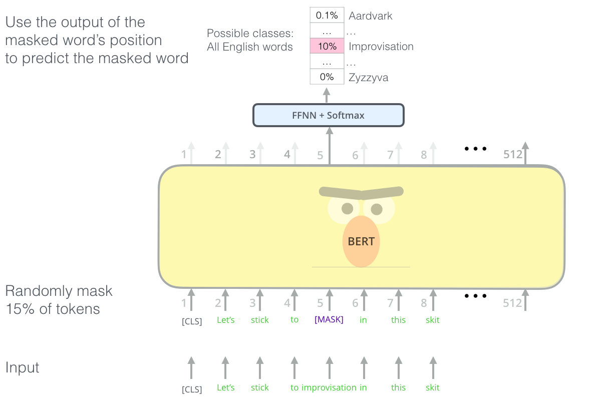

# Transformers & BERT

Comprehensive study notes on the Transformer architecture and BERT. All claims cited. Sources expanded beyond the original reference list to include RoBERTa, the Illustrated BERT series, and architectural ablation results, including deep mathematical derivations of Layer Normalization stability, catastrophic forgetting, and FFN key-value retrieval.

BERT (Bidirectional Encoder Representations from Transformers) [1] represents the pivot point of modern NLP. Before BERT: task-specific architectures, limited transfer. After BERT: a universal pre-train-then-fine-tune paradigm that achieves state-of-the-art on 11 NLP benchmarks simultaneously with minimal architectural changes.

<p align="center">
  
  <br>
  <em>Figure 1: The Transformer Encoder-Decoder stack. Visualization from Jay Alammar. BERT utilizes the Encoder stack on the left.</em>
</p>

---

## 1. The Transformer Architecture

### 1.1 Overview

The Transformer [2] is a sequence-to-sequence model that replaces recurrence entirely with **self-attention**.

The core of the Transformer is an encoder-decoder structure:
- **Encoder**: Maps an input sequence of symbol representations $`(x_1, \dots, x_n)`$ to a sequence of continuous representations $`\mathbf{z} = (z_1, \dots, z_n)`$.
- **Decoder**: Given $`\mathbf{z}`$, generates an output sequence $`(y_1, \dots, y_m)`$ autoregressively, consuming the previously generated symbols as additional input.

Each sub-layer uses a **residual connection** and **layer normalisation** [2]:
```math
\text{LayerNorm}(x + \text{Sublayer}(x))
```

### 1.2 Residual Connections

**Motivation:** In deep networks, gradients must pass through every layer during backpropagation. Without shortcuts, gradients can vanish (become zero) or explode (become infinite). The residual connection $`y = x + F(x)`$ ensures that the gradient has a direct path through the identity:

```math
\frac{\partial \mathcal{L}}{\partial x} = \frac{\partial \mathcal{L}}{\partial y} \cdot \left(1 + \frac{\partial F}{\partial x}\right)
```

Even if $`\partial F / \partial x \to 0`$, the gradient $`\partial \mathcal{L}/\partial x \neq 0`$. This enables training of networks with 12–96+ layers [2].

### 1.3 Layer Normalisation

**Batch Norm** normalises across the batch dimension — problematic for NLP because batch statistics are noisy for variable-length sequences.

**Layer Norm** [3] normalises across the feature dimension at each position independently:

```math
\text{LayerNorm}(x) = \gamma \cdot \frac{x - \mu}{\sqrt{\sigma^2 + \epsilon}} + \beta
```

where $`\mu, \sigma^2`$ are the mean and variance computed over the $`d_{model}`$ features of a single token, and $`\gamma, \beta`$ are learned scale and shift parameters. No dependence on batch size or other sequence positions [2].

**Pre-norm vs Post-norm Stability Math:**
- **Original Transformer (Post-norm):** $`x_{l+1} = \text{LayerNorm}(x_l + F(x_l))`$. At initialisation, the variance of the output grows linearly with depth $`L`$. Gradients near the output layer are much larger than those near the input, requiring a careful learning rate warmup to avoid divergence.
- **Modern practice (Pre-norm):** $`x_{l+1} = x_l + F(\text{LayerNorm}(x_l))`$. The main signal path bypasses the normalisation layer entirely. The variance of $`x_L`$ grows with $`O(L)`$, but the gradient $`\frac{\partial x_L}{\partial x_l} = I`$, meaning gradient flow is perfectly stable. Pre-norm models can be trained without learning rate warmup [3].

The shift from Post-norm to Pre-norm was the critical architectural tweak that allowed transformers to scale from 12 layers (BERT) to 96+ layers (GPT-3) without gradient vanishing.

### 1.4 Feed-Forward Sublayer

After each multi-head attention block, a **position-wise feed-forward network** (FFN) is applied independently to each position:

```math
\text{FFN}(x) = \max(0, xW_1 + b_1)W_2 + b_2
```

For BERT-base: $`d_{model} = 768`$, $`d_{ff} = 3072`$ (4× expansion). The FFN introduces non-linearity and dramatically increases the model's capacity.

**ReLU vs. GELU:** BERT uses GELU (Gaussian Error Linear Unit) [1]:
```math
\text{GELU}(x) = x \cdot \Phi(x)
```
where $`\Phi(x)`$ is the standard Gaussian CDF. GELU is smoother than ReLU and empirically improves performance on NLP tasks.

**Parameter count for FFN (BERT-base):**
- $`W_1 \in \mathbb{R}^{768 \times 3072}`$: 2,359,296 parameters
- $`W_2 \in \mathbb{R}^{3072 \times 768}`$: 2,359,296 parameters
- Total per layer: ~4.7M; × 12 layers: ~56.6M for all FFN

**The FFN as Key-Value Memory:** Research (Geva et al., 2021) [10] has shown that FFN layers function as key-value memories. Let $`k_i`$ be the $`i`$-th row of $`W_1`$ and $`v_i`$ be the $`i`$-th row of $`W_2`$. The output is a linear combination of the value vectors $`v_i`$:

```math
\text{FFN}(x) = \sum_{i=1}^{d_{ff}} f(x \cdot k_i) v_i
```

The inner product $`x \cdot k_i`$ matches the input $`x`$ against the "key" $`k_i`$. If it matches, the non-linearity $`f`$ activates, and the corresponding "value" $`v_i`$ is added to the token representation. Factual knowledge is stored primarily in these $`v_i`$ weights.

---

## 2. BERT: Architecture and Design Decisions

### 2.1 BERT vs. Encoder-Only Transformer

BERT [1] uses **only the encoder stack** of the Transformer. There is no decoder. This makes BERT:
- **Bidirectional:** Every position attends to all other positions in both directions (unlike GPT which uses causal masking)
- **Non-generative:** Cannot produce sequences autoregressively — not designed for text generation (unlike GPT)
- **Ideal for understanding tasks:** Classification, NER, QA, entailment

### 2.2 BERT-base vs. BERT-large

| Parameter | BERT-base | BERT-large |
| :--- | :--- | :--- |
| Layers ($`L`$) | 12 | 24 |
| Hidden size ($`H`$) | 768 | 1024 |
| Attention heads ($`A`$) | 12 | 16 |
| FFN size | 3072 | 4096 |
| Total parameters | ~110M | ~340M |

**BERT-base** is the standard choice for fine-tuning on classification tasks with limited data (e.g., mental health datasets). BERT-large achieves higher performance on benchmarks but requires more compute and training examples to fine-tune effectively.

<p align="center">
  
  <br>
  <em>Figure 2: BERT architecture variants (Base and Large). Source: Jay Alammar.</em>
</p>
### 2.3 Input Representation

BERT concatenates three types of embeddings at each position [1]:

```math
E = E_{token} + E_{position} + E_{segment}
```

<p align="center">
  
  <br>
  <em>Figure 3: BERT input representation combining Token, Position, and Segment embeddings. Source: Jay Alammar.</em>
</p>

- **Token embedding** ($`E_{token}`$): Lookup from the WordPiece vocabulary (30,522 entries for BERT-base-uncased)
- **Position embedding** ($`E_{position}`$): Learned embeddings for positions 0–511
- **Segment embedding** ($`E_{segment}`$): Learned embedding distinguishing Sentence A ($`E_A`$) from Sentence B ($`E_B`$) in paired-sentence tasks

For a single sentence input:
```
[CLS] The patient reports feeling hopeless [SEP]
  E_A   E_A    E_A     E_A    E_A        E_A   E_A
```

For a sentence pair (e.g., premise-hypothesis in NLI):
```
[CLS] Premise tokens [SEP] Hypothesis tokens [SEP]
  E_A  E_A    E_A    E_A   E_B   E_B   E_B   E_B
```

---

## 3. Pre-Training Objectives

### 3.1 Masked Language Model (MLM)

The key innovation enabling true bidirectionality: randomly mask 15% of input tokens and train the model to predict the original tokens.

**Selection procedure [1]:**
- Among masked positions: 80% → `[MASK]`, 10% → random token, 10% → unchanged

**Why not always use `[MASK]`?**
- If all masked positions used `[MASK]`, the model would learn that `[MASK]` means "predict me" and would produce suboptimal representations for normal (unmasked) tokens at fine-tuning time
- The 10% random token injection teaches the model to correct "noise" — improving robustness
- The 10% unchanged teaches the model that any token could be the target, forcing it to maintain good representations for all positions

**Loss function:** Cross-entropy only over the 15% masked positions:
```math
\mathcal{L}_{MLM} = -\frac{1}{|M|}\sum_{i \in M} \log P(w_i | \tilde{w})
```

where $`M`$ is the set of masked positions and $`\tilde{w}`$ is the corrupted sequence.

### 3.2 Next Sentence Prediction (NSP)

Train a binary classifier on the `[CLS]` embedding to predict whether two sentences are consecutive in the original document:

- 50% of pairs: genuinely consecutive sentences (label: `IsNext`)
- 50% of pairs: second sentence randomly drawn from corpus (label: `NotNext`)

**Purpose:** Teach BERT to understand inter-sentence relationships, useful for QA (question-context) and NLI (premise-hypothesis).

**Controversy:** RoBERTa [4] showed that NSP **hurts** performance when training with very large batches, arguing that it corrupts MLM by introducing out-of-document tokens. RoBERTa removes NSP and achieves better results.

---

## 4. Fine-Tuning BERT

BERT's power lies in the simplicity of its fine-tuning protocol. A single additional classification head is added, and the entire model is fine-tuned end-to-end [1]:

### 4.1 Sequence Classification (Mental Health Relevance)

```python
from transformers import BertForSequenceClassification

model = BertForSequenceClassification.from_pretrained(
    "mental/mental-bert-base-uncased",
    num_labels=4    # e.g., depression / anxiety / PTSD / normal
)

# Forward pass
outputs = model(input_ids, attention_mask=attention_mask)
logits = outputs.logits                    # (batch, num_labels)
probs = torch.softmax(logits, dim=-1)     # (batch, num_labels)
```

**Architecture:**
```
[CLS] token hidden state h_[CLS]
         ↓
Dropout (p=0.1)
         ↓
Linear(768, num_labels)
         ↓
Logits → Softmax → Probabilities
```

The `[CLS]` token aggregates information about the entire sequence through the self-attention mechanism. Its final hidden state is the sequence representation used for classification.

### 4.2 Fine-Tuning Hyperparameters [1]

BERT paper recommends:
- **Epochs:** 3–4
- **Batch size:** 16 or 32
- **Learning rate:** 2e-5, 3e-5, or 5e-5
- **Scheduler:** Linear warmup then linear decay
- **Warm-up steps:** 10% of total training steps

### 4.3 The Mechanics of Catastrophic Forgetting

**Why small learning rates?** BERT weights encode rich pre-trained knowledge. Large learning rates cause **catastrophic forgetting** — the model rapidly overwrites pre-trained weights, losing the benefit of pre-training. Let $`\theta_{pt}`$ be the pre-trained weights. During fine-tuning, the update is $`\theta \leftarrow \theta - \eta \nabla_\theta \mathcal{L}_{task}`$. If $`\eta`$ is large, the parameter distance $`\|\theta - \theta_{pt}\|^2`$ becomes large, moving the weights out of the local minimum found during pre-training.

Furthermore, because the classification head $`W_{cls}`$ is initialized randomly, the gradients flowing back into BERT during the first few steps are massive and unstructured. **Linear warmup** restricts $`\eta`$ to near-zero initially, giving $`W_{cls}`$ time to align with the pre-trained representations before large gradients can backpropagate and scramble the deeper layers.

### 4.4 Token Classification (NER)

For token-level tasks (NER, POS tagging), apply a classifier to each token's hidden state:

```python
# Hidden states: (batch, seq_len, 768)
hidden_states = outputs.last_hidden_state
logits = classifier(hidden_states)  # (batch, seq_len, num_entity_types)
```

**BERT-WordPiece alignment:** BERT tokenises at the subword level. For NER, the label of a word should correspond to its **first subword token**. Labels for continuation tokens (`##`-prefixed) are typically ignored in loss computation [1].

---

## 5. RoBERTa: Fixing BERT's Training Oversights

Liu et al. [4] performed a systematic replication study of BERT pre-training and found that **BERT was significantly undertrained**. Key changes in RoBERTa:

| Decision | BERT | RoBERTa | Effect |
| :--- | :--- | :--- | :--- |
| Training data | Books + Wikipedia (16GB) | Books + Wikipedia + CC-News + OpenWebText + Stories (160GB) | +++ |
| Training steps | 1M steps | 500K steps (larger batches) | + |
| Batch size | 256 | 8,192 (with larger LR) | ++ |
| NSP objective | Yes | **Removed** | + |
| MLM masking | Static (fixed at start) | **Dynamic** (new masks each epoch) | + |
| Sequence length | Mix of 128+512 | Always 512 | + |
| Tokenizer | WordPiece (30K) | Byte-level BPE (50K) | + |

**Dynamic masking:** BERT pre-generates masked training examples before training. Each example always has the same 15% masked. RoBERTa generates a new masking pattern each time an example is seen — effectively seeing 40 different views of each sentence across 40 training epochs, improving generalisation [4].

**Results:** RoBERTa achieves BERT-large-level performance with BERT-base training, matching or exceeding all models published at the time on GLUE, RACE, and SQuAD.

---

## 6. Decoder-Only Models: GPT Architecture

For completeness, GPT-style models [5] use **only the decoder stack** with causal masking:

| Property | BERT (Encoder-Only) | GPT (Decoder-Only) |
| :--- | :--- | :--- |
| Attention type | Bidirectional (full) | Causal (left-to-right only) |
| Primary task | Text understanding | Text generation |
| Fine-tuning approach | Add classification head | Prompt completion |
| Context | Full sentence simultaneously | Only left context at each step |
| Example models | BERT, RoBERTa, ALBERT | GPT-2, GPT-3, LLaMA, Falcon |
| Mental health use | MentalBERT classification | LLM counselling, prompt engineering |

---

## 7. BERT Model Variants Relevant to Mental Health NLP

| Model | Differences from BERT-base | Mental Health Relevance |
| :--- | :--- | :--- |
| **MentalBERT** [6] | Pre-trained on Reddit mental health posts (~1.28B tokens) | Best for mental health text; captures clinical informal language |
| **MentalRoBERTa** [6] | Same corpus, RoBERTa training regime | Potentially better with less training data |
| **BioBERT** | Pre-trained on PubMed + PMC biomedical literature | Clinical/medical text; formal clinical language |
| **ClinicalBERT** | Pre-trained on MIMIC-III clinical notes | Medical records; formal clinical notes |
| **PsychBERT** | Pre-trained on psychiatric literature | Academic/clinical psychiatric terminology |
| **BERTweet** | Pre-trained on 850M English tweets | Social media mental health posts; informal text |

**Why domain-specific pre-training matters [6]:** BERT's training corpus (Wikipedia, Books) uses formal language. Mental health discourse on Reddit, Twitter, and crisis hotlines uses:
- Informal contractions and slang (`"cant stop cryin"`, `"i'm so done"`)
- Clinical terms used in self-diagnosis contexts
- Abbreviations (`"meds"`, `"dx"`, `"tx"`)
- Emotional intensifiers and hedging (`"I feel like maybe"`)

MentalBERT [6] demonstrated that domain-specific pre-training improves depression, anxiety, and suicidality detection F1 by 1–5% over general BERT across multiple benchmarks.

---

## 8. BERT's Computational Properties

### 8.1 Memory During Fine-Tuning

Fine-tuning BERT requires storing:
- Model weights: ~420MB (BERT-base, float32)
- Gradient tensors: same as weights (~420MB)
- Optimiser states (Adam): 2× weights (~840MB for first/second moments)
- Activations for backprop: ~$`O(L \times n \times d_{model})`$

Total: typically 4–6GB GPU memory for BERT-base with batch size 16.

**Gradient checkpointing:** Trades compute for memory by recomputing intermediate activations during backward pass instead of storing them — allows larger batch sizes at 2–3× the compute cost.

### 8.2 Inference Speed

BERT-base processes a single batch of 32 sequences of length 128 in approximately 8–15ms on a modern GPU (varies by hardware). For deployment at scale, options include:
- **TorchScript / ONNX export:** JIT compilation, ~30% speedup
- **Quantisation (INT8):** 2–4× speedup, ~1% accuracy loss
- **Knowledge distillation:** DistilBERT — 40% smaller, 60% faster, retaining ~97% of BERT's performance

---

## References

* **[1]** J. Devlin, M. Chang, K. Lee, and K. Toutanova, "BERT: Pre-training of Deep Bidirectional Transformers for Language Understanding," *NAACL 2019*, arXiv:1810.04805. Available: [https://arxiv.org/abs/1810.04805](https://arxiv.org/abs/1810.04805)
* **[2]** A. Vaswani et al., "Attention Is All You Need," *NeurIPS 2017*, arXiv:1706.03762. Available: [https://arxiv.org/abs/1706.03762](https://arxiv.org/abs/1706.03762)
* **[3]** J. Ba, J. R. Kiros, and G. E. Hinton, "Layer Normalization," arXiv:1607.06450. Available: [https://arxiv.org/abs/1607.06450](https://arxiv.org/abs/1607.06450)
* **[4]** Y. Liu et al., "RoBERTa: A Robustly Optimized BERT Pretraining Approach," arXiv:1907.11692. Available: [https://arxiv.org/abs/1907.11692](https://arxiv.org/abs/1907.11692)
* **[5]** J. Alammar, *The Illustrated BERT, ELMo, and co.* Blog, 2018. Available: [https://jalammar.github.io/illustrated-bert/](https://jalammar.github.io/illustrated-bert/)
* **[6]** J. Ji et al., "MentalBERT: Publicly Available Pretrained Language Models for Mental Healthcare," arXiv:2110.15621. Available: [https://arxiv.org/abs/2110.15621](https://arxiv.org/abs/2110.15621)
* **[7]** C. Guo et al., "On Calibration of Modern Neural Networks," *ICML 2017*, arXiv:1706.04599. Available: [https://arxiv.org/abs/1706.04599](https://arxiv.org/abs/1706.04599)
* **[8]** Hugging Face, *NLP Course*. Available: [https://huggingface.co/learn/nlp-course/](https://huggingface.co/learn/nlp-course/)
* **[9]** L. Tunstall, L. von Werra, and T. Wolf, *Natural Language Processing with Transformers*. O'Reilly, 2022. Available: [https://www.oreilly.com/library/view/natural-language-processing/9781098103231/](https://www.oreilly.com/library/view/natural-language-processing/9781098103231/)
* **[10]** M. Geva, R. Schuster, J. Berant, and O. Levy, "Transformer Feed-Forward Layers Are Key-Value Memories," *EMNLP 2021*, arXiv:2012.14913. Available: [https://arxiv.org/abs/2012.14913](https://arxiv.org/abs/2012.14913)
