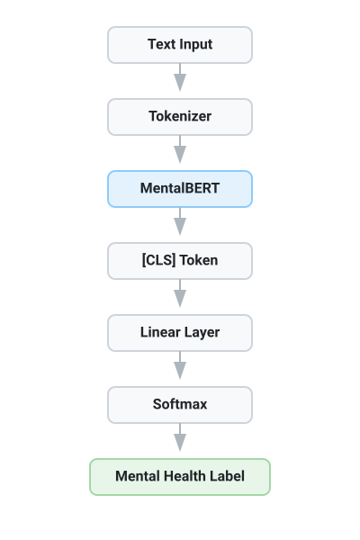

# Mental Health Text Classification

Comprehensive study notes on NLP for mental health classification. This domain serves as a high-stakes evaluation environment where the consequences of miscalibrated confidence and the complex semantic reality of clinical language make it an ideal testbed for evaluating reliability estimation frameworks.

This document covers datasets, models, ethical considerations, domain-specific challenges, and the state of the art.

  
   
  <em>Figure 1: A standard BERT-based mental health text classification pipeline.</em>

---

## 1. The Clinical Context

### 1.1 Why Text Classification?

Mental health disorders are among the leading causes of disability worldwide. Clinical assessment traditionally requires trained professionals and structured interviews — inaccessible for most of the population, especially in low- and middle-income countries.

Digital text data — social media posts, forum threads, chat logs, clinical notes — provides a large-scale, continuously updated signal of mental health states. NLP can scale professional-quality screening to populations and contexts previously unreachable [4][5].

**Key insight:** People often disclose mental health experiences in text before seeking clinical help. Reddit's mental health communities (r/depression, r/SuicideWatch, r/anxiety) contain millions of posts written by individuals describing their experiences — often more candidly than in clinical settings.

### 1.2 The Stakes of Getting It Wrong

This is not a typical classification problem. Errors have asymmetric consequences:

| Error Type | Consequence |
| :--- | :--- |
| **False Negative** (missed crisis) | A person in genuine crisis is not flagged — no intervention. In suicidality detection, this is a potential life-threatening failure. |
| **False Positive** (false alarm) | A person without a condition is flagged — unnecessary stigma, anxiety, or over-medicalization. |
| **Overconfident Wrong Prediction** | A model correctly guessing the label by chance but displaying high confidence — misleads clinicians who trust the output |

**Why calibrated confidence matters:** A model that knows when it does not know — expressing lower confidence on ambiguous or OOD inputs — is safer than a maximally accurate but overconfident classifier, because it allows human override at the right times.

---

## 2. Core Datasets and Benchmarks

### 2.1 CLPsych Shared Tasks

The Computational Linguistics and Clinical Psychology workshop [5] (held annually at ACL since 2014) has defined the primary benchmarks:

| Year | Task | Dataset | Classes |
| :--- | :--- | :--- | :--- |
| 2015 | User-level mental health detection | Twitter (self-reported diagnoses) | Depression, PTSD, Control |
| 2019 | Suicide risk assessment | Reddit r/SuicideWatch posts | No risk / Low / Moderate / Severe |
| 2022 | Mood change detection | Reddit longitudinal posts | Binary + temporal |
| 2024 | LLM-based evidence summarisation | Reddit + clinical data | Suicidality risk levels |
| 2025–26 | Mental health trajectory modelling | Reddit timelines (MIND framework) | Affect, Behaviour, Cognition, Desire |

**MIND framework (2026) [5]:** A structured dimensional model that bridges clinical psychology and NLP by operationalising suicidal ideation into four components:
- **Affect (A):** Emotional valence and intensity. NLP targets: sentiment analysis, emotion classification ("I feel hopeless", "I'm numb").
- **Behaviour (B):** Observable patterns and physical actions. NLP targets: entity extraction, event detection ("Can't sleep", "Stopped eating", "I bought pills").
- **Cognition (C):** Thought patterns, cognitive distortions, self-worth evaluations. NLP targets: perspective tracking, semantic similarity to known distortions ("I'm worthless", "Nobody cares").
- **Desire (D):** Goal/motivation, intent, future orientation. NLP targets: intent classification, temporal framing ("I want to disappear", "I hope tomorrow is better").

By mapping free text to these four dimensions, classifiers can provide explainable severity scores rather than opaque labels.

### 2.2 Key Non-CLPsych Datasets

| Dataset | Source | Labels | Notes |
| :--- | :--- | :--- | :--- |
| RSDD (Reddit Self-reported Depression) | Reddit | Depression / Control | 9,000 users, 107K posts |
| SMHD (Social Media Depression/Anxiety) | Reddit | 9 mental health conditions | 1.06M posts, multi-label |
| eRisk | Reddit | Depression, eating disorders | Longitudinal, task-based |
| DAIC-WoZ | Clinical interviews | Depression severity (PHQ-8) | Audio + text + video |
| PsychoPy | Social media | Suicidal ideation | Real-time crisis posts |
| SuicideWatch (SW) vs. Depression | Reddit | Binary | Common benchmark for model comparison |

### 2.3 Data Challenges

**Label acquisition [1]:** Clinical labels require expert annotation, which is:
- Expensive (trained clinicians needed)
- Slow (careful review of long post histories)
- Noisy (inter-rater disagreement especially for mild cases)

**Proxy labels [1]:** Most datasets use "weak supervision" — treating self-reported diagnoses or subreddit membership as ground truth labels. This is imperfect:
- r/depression membership ≠ clinical depression diagnosis
- Users may post ironically, seek support for others, or have recovered
- Subreddit moderators remove extreme content, biasing the sample

---

## 3. The NLP Pipeline for Mental Health Classification

### 3.1 Standard Architecture (Modern)

### 3.2 Feature Engineering (Pre-Deep Learning)

Before transformer models, mental health classifiers relied on hand-crafted features:

- **Linguistic Inquiry and Word Count (LIWC):** Dictionary-based emotional lexicon (categories: negative affect, sadness, death, social relations, cognitive processes)
- **Sentiment scores:** Valence, arousal, dominance from SentimentNet or VADER
- **N-gram TF-IDF:** Character and word n-grams as sparse features
- **Punctuation and writing style:** All-caps words, exclamation marks, paragraph length
- **Topic models:** LDA topics capturing depression/anxiety thematic clusters

These features remain **interpretable** and are often combined with deep models in hybrid architectures.

---

## 4. MentalBERT: Domain-Specific Pre-Training

### 4.1 Motivation

Ji et al. [1] trained MentalBERT and MentalRoBERTa — two domain-specific language models pre-trained on Reddit mental health communities.

**Training corpus:**
- Source: Reddit communities related to mental health (`r/depression`, `r/SuicideWatch`, `r/anxiety`, `r/mentalhealth`, `r/schizophrenia`, `r/bipolar`, `r/ptsd`, etc.)
- Size: ~1.28 billion tokens (approximately 44M Reddit posts)
- Pre-training: Masked Language Model (MLM) only (no NSP)
- Base architecture: BERT-base-uncased (12 layers, 768 hidden, 12 heads)

### 4.2 Why Domain Pre-Training Helps

The vocabulary shift between Wikipedia/BookCorpus (BERT's training data) and Reddit mental health posts is substantial:

| Linguistic Feature | Wikipedia | Reddit MH |
| :--- | :--- | :--- |
| Average sentence length | 25–30 tokens | 8–15 tokens |
| Capitalisation | Formal | Often lowercase, erratic |
| Vocabulary | Academic, formal | Informal, abbreviations, slang |
| Clinical terms | Rare | Frequent (self-diagnosis context) |
| Emotional intensifiers | Rare | Common ("so fucking tired") |
| Colloquial mental health | Absent | Core vocabulary ("meds", "dx", "depressed") |

General BERT has underdeveloped representations for tokens that are frequent in clinical social media but rare in formal text. MentalBERT's MLM training on this domain corrects these representations.

### 4.3 Results [1]

Tested on five mental health classification benchmarks:

| Task | BERT-base | RoBERTa | **MentalBERT** | **MentalRoBERTa** |
| :--- | :--- | :--- | :--- | :--- |
| Depression detection (Reddit) | 83.9 F1 | 85.6 F1 | **86.2 F1** | **86.4 F1** |
| Suicidal ideation detection | 89.1 F1 | 90.3 F1 | **91.4 F1** | **92.0 F1** |
| Suicide severity classification | 68.4 F1 | 69.1 F1 | **70.8 F1** | **71.4 F1** |
| PTSD detection | 82.3 F1 | 84.1 F1 | **84.8 F1** | **85.5 F1** |
| Stress detection | 76.5 F1 | 77.8 F1 | **78.5 F1** | **79.2 F1** |

Consistent improvements of 1–3% F1 across all tasks. The gains are most pronounced for **suicide severity classification** — the hardest task, most sensitive to nuanced clinical language.

---

## 5. Classification Task Types

### 5.1 Binary Classification (Most Common)

**Depression detection:** Positive (depressed user) vs. Negative (control user)

Simple threshold on max softmax probability. Standard metrics: F1-macro, AUROC.

**Limitation:** Binary classification collapses a continuous severity spectrum into two categories. A post expressing mild sadness and a post expressing suicidal crisis are both "positive." The model gives no information about severity.

### 5.2 Multi-Class Classification

**Suicide risk assessment (CLPsych 2019):**
- No risk
- Low risk (some ideation, no plan)
- Moderate risk (ideation with partial plan)
- Severe risk (clear plan, intent)

Calibrated confidence is most impactful here: a model that says "65% Moderate Risk" is more useful than one that says "100% Moderate Risk" — the former appropriately reflects uncertainty and invites human review.

### 5.3 Multi-Label Classification

A post can simultaneously indicate depression AND anxiety AND PTSD. **SMHD dataset** provides multi-label annotations for 9 conditions. Requires:
- Independent sigmoid outputs (not softmax)
- Per-class calibration separately
- Different evaluation metrics (micro/macro F1, Jaccard similarity)

**Calibration complexity:** Multi-label calibration is significantly harder than multi-class — each label's confidence must be independently calibrated, and correlations between labels must be handled.

### 5.4 Regression / Severity Scoring

Some tasks require predicting a continuous severity score (PHQ-9 score for depression: 0–27). Models output a real number with uncertainty bounds. **DAIC-WoZ** is the primary benchmark.

**Why uncertainty matters:** Uncertainty in severity regression is directly actionable — a wide prediction interval means clinical staff should assess directly rather than relying on the automated score.

---

## 6. Challenges Specific to Mental Health NLP

### 6.1 Linguistic Complexity

**Clinical Jargon and Lexical Rareness:**
Mental health communities develop highly specific sub-vocabularies. 
- *Case study 1 (Medical):* "Starting my taper off effexor and the brain zaps are making me dissociate." A general LM may understand "zaps" as electricity, completely missing the severe SSRI withdrawal symptom. 
- *Case study 2 (Community Slang):* "grippy sock vacation" (involuntary psychiatric hold), "unalive" (suicide, used to bypass automated filters), "S/H" (self-harm).
These rare lexical features often trigger high epistemic uncertainty in general models, demanding domain-specific pre-training.

**Code-switching:** Users mix clinical vocabulary with colloquial language: *"I've been so anhedonic lately, like I literally can't be bothered to do anything lol"*. The same sentence combines a clinical term (`"anhedonic"`) with slang (`"lol"`) — challenging both tokenisation and semantic interpretation.

**Figurative language [4]:** A major source of false positives:
- *"I'm dead"* — excitement (not suicidality)
- *"I want to kill my roommate"* — anger (not violence intent)
- *"I'm going through it"* — general difficulty (may or may not be clinical)

These figurative uses of crisis language are indistinguishable at the surface level from literal expressions. They require discourse context and pragmatic understanding that current models lack.

**Temporal expression:** Mental health states evolve over time. A single post captures a snapshot. Longitudinal models (tracking a user's post history) significantly outperform single-post models but require persistent user tracking — a privacy concern [5].

### 6.2 Class Imbalance

In real-world deployment:
- Crisis-level suicidal posts: ~1% of mental health forum posts
- Major depression: ~10–20% of general social media
- Normal/no-condition: 70–85%

Standard cross-entropy training on imbalanced data biases the model toward the majority class. Consequences:
- High accuracy on "normal" class, low recall on crisis class
- Model overconfident about "normal" for borderline cases
- ECE dramatically worse for minority classes

**Mitigation strategies:**
- Class-weighted loss: $`\mathcal{L} = -w_y \log \hat{p}_y`$ where $`w_y \propto 1/\text{class frequency}`$
- Oversampling/undersampling
- SMOTE in feature space
- Per-class temperature scaling (vector scaling)

### 6.3 Label Subjectivity and Inter-Annotator Disagreement

Mental health labels involve clinical judgment. Between two trained annotators, inter-rater agreement (Cohen's κ) is typically:
- Depression vs. normal: κ ≈ 0.70–0.85 (substantial agreement)
- Suicide risk levels: κ ≈ 0.50–0.65 (moderate agreement)
- Emotion fine-grained: κ ≈ 0.35–0.55 (fair agreement)

Low inter-annotator agreement → labels themselves carry aleatoric uncertainty. A model should not be overly confident on cases where even human experts disagree.

**Soft labels:** Inter-annotator agreement can be used to construct **soft labels** (label distributions rather than hard labels) for training. The calibration target for uncertain cases becomes a smoother distribution rather than a one-hot vector.

### 6.4 Data Privacy and Ethical Considerations [4]

**Reddit data:** Reddit posts are public, but mental health posts represent sensitive disclosures. Key concerns:
- Users may not realise their posts are used for research
- Re-identification risks even in "anonymised" datasets
- Potential for harm if models are deployed without clinical oversight

**Model deployment ethics [4]:**
- Over-reliance: clinicians may defer to model predictions, reducing human oversight
- Stigma: automated mental health labelling can create permanent records
- Bias: models trained predominantly on English Reddit data generalise poorly to other languages, cultures, and demographics
- Transparency: "black box" predictions without explanations are insufficient for clinical use

---

## 7. Evaluation Metrics for Mental Health Classification

### 7.1 Standard Classification Metrics

| Metric | Formula | When to Use |
| :--- | :--- | :--- |
| **F1-Macro** | Mean F1 per class (equal class weight) | Imbalanced datasets — treats all classes equally |
| **F1-Micro** | F1 computed globally across all instances | Overall performance on all predictions |
| **F1-Weighted** | Mean F1 per class (weighted by support) | When class frequency matters |
| **AUROC** | Area under ROC curve | Binary: discriminability regardless of threshold |
| **Cohen's κ** | Inter-rater style agreement metric | Adjusted for chance agreement |

### 7.2 Mental Health-Specific Metrics

**Sensitivity (Recall) for positive class:** In crisis detection, sensitivity is often prioritised over precision — it is more dangerous to miss a crisis than to have a false alarm. Minimum acceptable sensitivity is typically set by clinical guidelines (e.g., 90% sensitivity for suicidality).

**Risk-stratified AUROC:** Compute AUROC separately for borderline cases (model confidence 0.4–0.6) — these are the most clinically relevant uncertain predictions.

**Early detection:** For longitudinal tasks, the F-latency metric measures how early in a post history the model correctly identifies a condition — earlier detection is more valuable.

---

## 8. LLMs for Mental Health

### 8.1 Capabilities

Kang et al. [4] reviewed 30 studies (2017–2024) on LLMs in mental health. Key capabilities:

- **Zero-shot detection:** GPT-4 with appropriate prompting achieves competitive performance on depression and suicidality detection tasks without fine-tuning — often comparable to fine-tuned BERT-base
- **Interpretability:** LLMs can provide evidence-based explanations: *"This post shows signs of depression because of phrases X, Y, Z"*
- **Conversational therapy:** LLM-based chatbots (Woebot, Wysa) provide CBT-guided interactions — not classification, but therapeutic support

### 8.2 Limitations of LLMs [4]

- **Calibration:** LLMs are notoriously overconfident in verbalized probabilities — "I am 90% confident this indicates depression" cannot be trusted as a probability
- **Hallucination:** LLMs may fabricate clinical justifications that sound plausible but are factually incorrect or clinically unsound
- **Multilingual data gap:** Most LLM training is English-dominated; performance on non-English mental health text drops significantly
- **Privacy:** Sending sensitive mental health disclosures to commercial LLM APIs raises serious privacy concerns
- **Ethical framework:** No clear consensus on when LLM clinical use is appropriate; risk of over-reliance remains high

### 8.3 The Hybrid Deployment Approach

Current best practice emerging from the literature: use **fine-tuned BERT-based models** (MentalBERT, MentalRoBERTa) for initial classification (well-calibrated, locally deployed, privacy-preserving), and LLMs for **explanation generation** and **borderline case review** — providing interpretability where the classifier's confidence is low.

A representative hybrid pipeline proceeds as follows:
1. A user post is embedded by MentalBERT.
2. MentalBERT produces calibrated class probabilities for the post.
3. If the resulting max probability exceeds $`0.90`$, accept the label autonomously.
4. If the max probability is between $`0.50`$ and $`0.90`$, the high uncertainty triggers a fallback. The post is passed to a local LLaMA-3 model with a specialized prompt: *"The classifier is uncertain if this post indicates suicide risk or mild depression. Analyze the cognitive and affective markers using the MIND framework to provide a detailed clinical summary."*
5. Clinicians review the LLM's explanation rather than trusting an uncalibrated point estimate.

This hybrid pipeline maximizes throughput by auto-clearing high-confidence in-distribution cases, while reserving computationally expensive LLM inference (and human clinician time) for uncertain borderline cases flagged by low classifier confidence.

---

## 9. Model Performance Landscape (2024)

| Model | Task | F1 / AUROC | Notes |
| :--- | :--- | :--- | :--- |
| LIWC + SVM (2014) | Depression detection | F1 ≈ 0.71 | Interpretable baseline |
| LSTM (2018) | Depression detection | F1 ≈ 0.79 | Sequential features |
| BERT-base (2019) | Depression detection | F1 ≈ 0.84 | Pre-trained features |
| MentalBERT (2022) | Depression detection | **F1 ≈ 0.86** | Domain-specific PT |
| GPT-4 zero-shot (2023) | Suicidal ideation | AUROC ≈ 0.87 | No fine-tuning needed |
| Ensemble (BERT + features) | Suicide risk levels | **F1 ≈ 0.73** | CLPsych 2019 best |
| LLM + fine-tuned BERT (2024) | Evidence summarization | Task-specific | CLPsych 2024 |

---

## 10. Relevance to Reliability Estimation

### 10.1 The Calibration Crisis in Mental Health NLP

Fine-tuned MentalBERT models, despite their accuracy improvements, are not reliably calibrated. Specifically:
- Models are frequently overconfident on borderline cases (e.g., ambiguous figurative language).
- High softmax confidence ($p_{max}$) is not a reliable indicator of whether the model has actually understood the clinical nuance.
- Miscalibrated overconfidence can lead to dangerous "False Negative" overrides in clinical deployment.

This highlights why reliability estimation is critical in clinical NLP: semantic neighborhoods may predict reliability better than $p_{max}$.

### 10.2 Semantic Disagreement in Mental Health Data

Reliability estimation often tests whether the geometry of the local semantic neighborhood contains reliability information. Mental health data naturally produces high semantic variability:

| Clinical Phenomenon | Effect on Embedding Space | Geometric Signal |
| :--- | :--- | :--- |
| Figurative language ("I'm dead") | High semantic variance among neighbors | High Entropy ($H_{knn}$), Low Purity |
| Clinical abbreviation density | Sparse, isolated representation | Low Density ($\rho$) |
| Novel crisis expressions | Disagreement between logits and semantic neighbors | High $D_{KL}$ / $JS$ Divergence |

### 10.3 The Goal: Discovering Reliability Signals

A fundamental hypothesis in this space is: **If a MentalBERT model predicts "Severe Risk" with 99% confidence, but the K-Nearest Neighbors in the representation space are highly mixed (high entropy) or disagree with the prediction (high KL divergence), is that prediction more likely to be an error?**

Proving this link would allow downstream applications (like dynamic temperature scaling) to use geometric signals to safely flag uncertain cases for human clinical review.

---

## References

* **[1]** J. Ji, C. Gao, M. Peng, L. Wei, B. Zhu, and A. Zhang, "MentalBERT: Publicly Available Pretrained Language Models for Mental Healthcare," *IJCAI 2022*, arXiv:2110.15621. Available: [https://arxiv.org/abs/2110.15621](https://arxiv.org/abs/2110.15621)
* **[2]** Y. Liu et al., "Detecting Mental Health Conditions in Social Media," *Nature Scientific Reports 2017*, DOI:10.1038/srep45141. Available: [https://doi.org/10.1038/srep45141](https://doi.org/10.1038/srep45141)
* **[3]** X. Zhang et al., "Artificial Intelligence-Assisted Mental Disorders Detection: A Survey," *ACM Computing Surveys 2024*. Available: [https://dl.acm.org/doi/full/10.1145/3681794](https://dl.acm.org/doi/full/10.1145/3681794)
* **[4]** Y. Kang et al., "Large Language Model for Mental Health: A Systematic Review," arXiv:2403.15401. Available: [https://arxiv.org/abs/2403.15401](https://arxiv.org/abs/2403.15401)
* **[5]** ACL CLPsych Workshop — Annual proceedings since 2014. Available: [https://aclanthology.org/venues/clpsych/](https://aclanthology.org/venues/clpsych/)
* **[6]** Hugging Face, MentalBERT model card. Available: [https://huggingface.co/mental/mental-bert-base-uncased](https://huggingface.co/mental/mental-bert-base-uncased)
* **[7]** A. Zirikly et al., "CLPsych 2019 Shared Task: Predicting the Degree of Suicide Risk in Reddit Posts," *CLPsych 2019*. Available: [https://aclanthology.org/W19-3003/](https://aclanthology.org/W19-3003/)
* **[8]** K. Yates, C. Cohan, and N. Goharian, "Depression and Self-Harm Risk Assessment in Online Forums," *EMNLP 2017*, arXiv:1709.01848. Available: [https://arxiv.org/abs/1709.01848](https://arxiv.org/abs/1709.01848)
* **[9]** P. Resnik, W. Armstrong, L. Claudino, and T. Nguyen, "Beyond LDA: Exploring Supervised Topic Modeling for Depression-Related Language in Twitter," *CLPsych 2015*. Available: [https://aclanthology.org/W15-1204/](https://aclanthology.org/W15-1204/)
* **[10]** C. Guo et al., "On Calibration of Modern Neural Networks," *ICML 2017*, arXiv:1706.04599 — for calibration context in mental health deployment. Available: [https://arxiv.org/abs/1706.04599](https://arxiv.org/abs/1706.04599)
